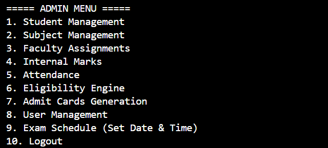
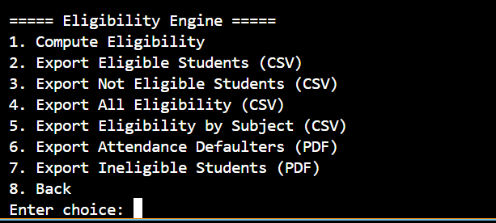

# Java Exam Ticketing and Management System 🎓

A **Java console-based examination management system** designed to automate and manage university examination processes including student records, attendance tracking, subject management, exam scheduling, and admit card generation.

---

# Features

- Student Management
- Subject Management
- Attendance Tracking
- Eligibility Checking
- Internal Assessment Management
- Faculty Assignment
- Exam Schedule Management
- Admit Card Generation (PDF)
- Authentication System
- CSV Data Import/Export

---

# Architecture

The project follows a **layered architecture**:

CLI Layer → User interaction  
Service Layer → Business logic  
DAO Layer → Database access  
Model Layer → Entity classes  

```
CLI → Service → DAO → Database
```

---

# Tech Stack

Language:
- Java

Database:
- MySQL

Libraries:
- JDBC
- OpenPDF
- Apache PDFBox

Architecture:
- Layered Architecture
- DAO Pattern

---

# Project Structure

```
src/
 ├── auth        # Authentication logic
 ├── cli         # Command line interface
 ├── dao         # Database access objects
 ├── model       # Entity classes
 ├── service     # Business logic
 ├── util        # Helper utilities
 ├── seed        # Default data loaders
 └── Main.java   # Application entry point
```
## 🔄 System Workflow

1. Admin / Staff logs into the system  
2. Student and subject data is managed through CLI  
3. Faculty enters internal marks and attendance  
4. System validates attendance and marks  
5. Eligibility engine evaluates each student per subject  
6. Eligible / Not Eligible status is assigned  
7. Admit cards are generated based on eligibility  
8. Results are stored in the database
--
## Screenshots

### Admin Menu



### Eligibility Engine



### Admit Card Generation
---

<h3>Admit Card Generation</h3>
<p align="center">
  
</p>
# How to Run

### 1 Install Java

Java 8 or above required.

Check version:

```
java -version
```

---

### 2 Setup MySQL

Create database:

```
CREATE DATABASE exam_system;
```

Update DB credentials in:

```
DBConnectionManager.java
```

---

### 3 Compile Project

```
javac -cp ".;lib/mysql-connector-j.jar" src/Main.java
```

---

### 4 Run Application

```
java Main
```
### Refer the csv files for the importing formats
---

## How to Use

1. Login using admin credentials
2. Navigate through the menu
3. Add students and subjects
4. Enter internal marks and attendance
5. Run eligibility check
6. Generate admit card


## Examination Eligibility Evaluation Rules

The **Examination Ticketing System** automatically determines whether a student is eligible to appear for an examination based on predefined academic criteria. The evaluation process uses **internal assessment marks and attendance records** stored in the system.

---

### Eligibility Criteria

A student is considered **eligible for a subject** only if the following conditions are satisfied:

1. **Minimum Internal Assessment Marks**
   - The student must obtain the minimum required internal assessment marks as defined by institutional regulations.

2. **Minimum Attendance Requirement**
   - The student must meet the minimum attendance percentage required for the subject.

3. **Subject-wise Evaluation**
   - Eligibility is evaluated separately for each subject using the student’s internal marks and attendance data.

If any of these conditions are not satisfied, the student will be marked **NOT ELIGIBLE** for that subject.

---

### Eligibility Verification Process

The system follows the steps below to evaluate eligibility:

1. Retrieve student internal assessment marks from the database.
2. Retrieve attendance percentage for each subject.
3. Compare marks and attendance against the required thresholds.
4. Assign an eligibility status for each subject.

Possible outcomes:

| Status | Description |
|------|-------------|
| ELIGIBLE | Student satisfies both marks and attendance requirements |
| NOT ELIGIBLE | Student fails to satisfy one or more eligibility criteria |

---

### Admit Card Generation Rule

The admit card generation module strictly follows the eligibility evaluation results.

- Admit cards are generated **only after eligibility verification**.
- Subjects marked **NOT ELIGIBLE** will still appear on the admit card with their eligibility status.
- This ensures transparency in the examination process.

---

### Example Eligibility Output

| Subject | Eligibility Status |
|-------|--------------------|
| Data Structures | ELIGIBLE |
| Computer Organization | NOT ELIGIBLE |
| Operating Systems | NOT ELIGIBLE |

---

### Advantages of Automated Eligibility Evaluation

- Prevents ineligible students from appearing for examinations
- Reduces manual verification workload
- Ensures consistent enforcement of academic rules
- Improves transparency in examination management
# Sample Functionalities

- Add new students
- Assign subjects
- Track attendance
- Check exam eligibility
- Generate admit cards
- Assign faculty to subjects
- Manage exam schedules

---


---
## ⚠️ Limitations

- Console-based interface (no web UI)
- No real-time notifications for students
- Backlog scheduling not fully implemented
- Requires manual database setup
---

# Future Improvements

- Web Interface
- REST API
- Role-based authentication
- Email notifications
- Docker deployment
- Backlog Manager

---

# Author

Radhika D Chougale

---

⭐ If you found this project useful, consider giving it a star.
